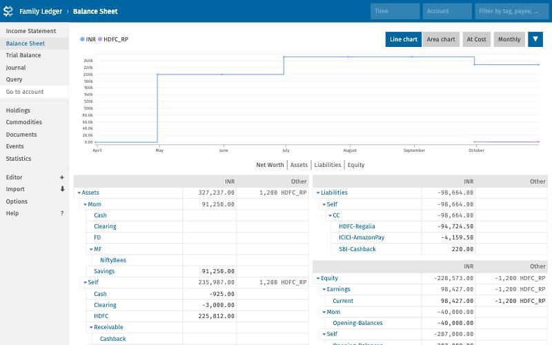

# Personal Finance — family books in plain text

One double-entry ledger for a household of three — **Self**, **Wife** and **Mom** — kept
as plain-text [Beancount](https://beancount.github.io/) files and browsed in
[Fava](https://beancount.github.io/fava/). Python scripts fill it for you: they unlock
and read credit-card and bank statement PDFs, read grocery bills with a local AI model,
track card fee waivers and reward points, and remind you of due dates.


<sub>The demo family (all data made up), as Fava shows it.</sub>

## What it does

| | |
|---|---|
| **Statements → ledger** | Unlocks password-protected HDFC / SBI / ICICI card and bank PDFs (in memory, never written decrypted), reads every transaction, categorises it, and appends it. Re-importing the same PDF adds nothing. |
| **Money between family members** | ₹50,000 leaving your account and arriving in Mom's two days later becomes **one** transaction, tagged `#gift` with its tax note (s.56(2)(x)); transfers to Wife carry the s.64 clubbing note. |
| **Grocery receipts** | A photo of a DMart / KPN / Smart Point / Army CSD bill is read by Gemma (via Ollama). Every line is stored item by item ("Lion Dates 500g" → Dates, 0.5 kg, ₹360/kg) in `data/sidecar.db`; the bill total goes into the ledger. |
| **Cards** | Spend so far in the card year vs the fee-waiver target (e.g. ₹4L), what is still needed per day, and reward points kept as their own units (`HDFC_RP`, `SBI_CASHBACK`). |
| **Opportunity cost** | What idle wallet money (Amazon Pay, Paytm) costs you at 7% a year; quarterly price trend of any grocery item; items whose price jumped. |
| **Reminders & backup** | Google Calendar reminders 7 and 2 days before insurance renewals and card due dates; ledger + database backed up to Google Drive. |
| **Weekly nudge** | Builds a numbers-only summary of the week and asks Gemma for 3–5 concrete, money-saving nudges. |
| **Prices** | Mutual fund NAVs from AMFI and stock closes from yfinance, so Fava shows market value. |

Everything runs on your machine. The only network calls are price downloads, the AI
model (local by default), and Google — and Google only writes when you add `--apply`.

---

## Requirements

| Need | For | Notes |
|---|---|---|
| **Python 3.11+** | everything | tested on 3.12. Check: `python3 --version` |
| **git** | getting the code | |
| macOS | Keychain for secrets, HEIC photos | Linux works too: secrets go to Secret Service or environment variables; convert HEIC to JPG yourself |
| *Optional:* **Ollama** + `gemma3:4b` (~3 GB, 8 GB RAM) | reading receipts, weekly nudges | or any Ollama host, including cloud |
| *Optional:* a **Google account** + a Google Cloud project | Calendar reminders, Drive backup | free; setup below |

---

## Quick start: try the demo (5 minutes)

The demo builds a made-up family with encrypted statement PDFs and receipts, so you can
see every feature before touching your own data.

```bash
git clone https://github.com/gokul2908/personal-finance.git
cd personal-finance
python3 -m venv .venv
.venv/bin/pip install -r requirements.txt
.venv/bin/python -m pytest -q tests
```

Build the demo and point the scripts at it (this sets `PF_ROOT` and the fake identities
the demo PDFs are locked with):

```bash
eval "$(.venv/bin/python scripts/demo.py demo | grep '^export')"
```

Feed it, then look at the results:

```bash
R=demo/data/raw_receipts
for f in smartpoint-2026-03-10 kpn-2026-06-12 csd-2026-09-27; do .venv/bin/python scripts/receipt_engine.py ingest $R/$f.png --from-json $R/$f.json; done
.venv/bin/python scripts/receipt_engine.py ingest $R/dmart-2026-09-14.png --from-json $R/dmart-2026-09-14.json --paid-with Liabilities:Self:CC:HDFC-Regalia
.venv/bin/python scripts/importer.py import
.venv/bin/python scripts/milestones.py status --date 2026-09-30
.venv/bin/python scripts/analytics.py price-timeline Tomato
.venv/bin/fava --port 5050 demo/ledgers/main.beancount
```

Open http://localhost:5050 (port 5000 is taken by AirPlay on macOS). When you are done, open a **new terminal** (or
`unset PF_ROOT`) so the scripts go back to your real books.

<details>
<summary>What the demo contains</summary>

- Five encrypted September statements: HDFC Regalia card, SBI Cashback card, ICICI Amazon
  Pay card, a Self HDFC savings account and Mom's savings account — each locked with the
  pattern its bank really uses.
- Four grocery bills across three quarters (tomato goes ₹30 → ₹42 → ₹61/kg).
- A ₹50,000 gift to Mom, a card bill payment, a refund, a card payment whose bank side is
  missing (it waits in Clearing), an Amazon Pay balance, two insurance renewals.
- `--from-json` stands in for the AI model: each receipt comes with the JSON Gemma would
  return, so the demo needs no Ollama.

</details>

---

## Set up your own books

### 1. Install

```bash
git clone https://github.com/gokul2908/personal-finance.git
cd personal-finance
python3 -m venv .venv
.venv/bin/pip install -r requirements.txt
```

### 2. Describe your accounts

```bash
cp config/config.example.toml config/config.toml
```

Edit `config/config.toml` (it is git-ignored). For **each credit card and bank account**,
add or adjust a `[sources.<id>]` block, then make sure the ledger opens that account.
For example, to add an HDFC Millennia card, put this in `config/config.toml`:

```toml
[sources.hdfc-millennia]
kind = "card"
entity = "self"
parser = "hdfc_cc"
account = "Liabilities:Self:CC:HDFC-Millennia"
match = ["*millennia*.pdf"]
last4 = "1234"
anniversary = "08-20"
fee_waiver_spend = 100000
due_day = 15
```

and this in `ledgers/self.beancount`:

```beancount
2020-01-01 open Liabilities:Self:CC:HDFC-Millennia   INR
```

<details>
<summary>Every field of a <code>[sources.*]</code> block</summary>

| Field | Meaning |
|---|---|
| `kind` | `card` or `bank` |
| `entity` | `self`, `wife` or `mom` — whose ledger file gets the transactions |
| `parser` | `hdfc_cc`, `sbi_cc`, `icici_cc`, or `bank_balance` (any savings statement that prints a running balance) |
| `account` | the Beancount account; must be `open`ed in that person's ledger file |
| `match` | filename globs (case-insensitive) that identify this source's PDFs |
| `last4` | last 4 card digits: used by SBI's password and to recognise a PDF with an unknown filename |
| `anniversary` | `MM-DD` the card year starts (issue / renewal date) |
| `fee_waiver_spend` | spend in a card year that waives the next annual fee |
| `milestone_counts` | regex: a purchase counts when its other leg's account matches (default: expenses, not fees) |
| `milestone_exclude` | regexes on the description that never count (fuel, rent, wallet loads…) |
| `reward_commodity`, `reward_account`, `reward_income` | reward points as their own commodity (declare it in `ledgers/commodities.beancount`) |
| `reward_points`, `reward_per_inr` | earn rate, e.g. 4 points per ₹150 |
| `due_day` | payment due day of the month → calendar reminder |

Other sections of the config:

| Section | Controls |
|---|---|
| `[entities.*]` | the three people; `label` is the account segment (`Assets:<label>:…`) |
| `[passwords]` | PDF password patterns tried per parser |
| `[[rules]]` | categorisation: description regex → account, first match wins |
| `[transfers]` | ±days window, transfer keywords, tax notes per direction |
| `[receipts]` | grocery expense account, default payer, how far a bill total may differ from its lines |
| `[ollama]` | host and model names |
| `[analytics]` | idle-money rate (7%), which accounts count as wallets, inflation thresholds |
| `[google]` | calendar id, reminder offsets, Drive folder name |

Grocery item names (what "Lion Dates 500g" maps to) live in `config/canonical_items.toml`.

</details>

### 3. Store the details that unlock your PDFs

Banks lock statements with your name and date of birth. They go in the macOS Keychain —
never in a file:

```bash
.venv/bin/python scripts/common.py secret set self.name      # as printed on the card
.venv/bin/python scripts/common.py secret set self.dob       # YYYY-MM-DD
.venv/bin/python scripts/common.py secret set mom.name
.venv/bin/python scripts/common.py secret set mom.dob
.venv/bin/python scripts/common.py secret set mom.customer_id   # only if her bank uses it
.venv/bin/python scripts/common.py secret status
```

<details>
<summary>Password patterns, and using environment variables instead</summary>

Each parser tries its patterns in order, then `fallback`:

| Parser | Default patterns | Example (Arjun, born 12-05-1990, card …8765) |
|---|---|---|
| `hdfc_cc` | first 4 letters of name in CAPS + DDMM | `ARJU1205` |
| `icici_cc` | first 4 letters lowercase + DDMM | `arju1205` |
| `sbi_cc` | DOB DDMMYYYY + last 4 card digits | `120519908765` |
| `bank_balance` | customer ID, then the name patterns | `55512345` |

Banks change these occasionally; the rule is in the e-mail that carries the statement.
Edit `[passwords]` in your config if yours differs. Placeholders: `{name4_upper}`
`{name4_lower}` `{name4_title}` `{ddmm}` `{ddmmyy}` `{ddmmyyyy}` `{yyyy}` `{last4}`
`{customer_id}`. When nothing works, the error lists the patterns it tried and any
missing secret — never a password — and `--ask-password` lets you type one.

No Keychain (Linux without Secret Service, CI)? Set environment variables instead —
`PF_SECRET_` + the key in capitals with `.` → `_`:

```bash
export PF_SECRET_SELF_NAME="Your Name" PF_SECRET_SELF_DOB=1990-05-12
```

</details>

### 4. Check the ledger and open Fava

```bash
.venv/bin/bean-check ledgers/main.beancount && echo OK
.venv/bin/fava --port 5050 ledgers/main.beancount     # http://localhost:5050
```

### 5. Import your first statements

```bash
cp ~/Downloads/<your statement>.pdf data/raw_statements/
.venv/bin/python scripts/importer.py import --dry-run      # shows what it would add
.venv/bin/python scripts/importer.py import
```

Compare the result in Fava with the statement's closing balance. Lines the importer could
not categorise are flagged `!` and booked to `Uncategorized` — add a `[[rules]]` entry
and fix them in the ledger file.

<details>
<summary>A statement imported 0 lines, or the wrong ones</summary>

The parsers follow the usual HDFC / SBI / ICICI layouts, but banks change them. See
exactly what text the PDF contains:

```bash
.venv/bin/python scripts/importer.py import data/raw_statements/<file>.pdf --dump-text --dry-run
```

Each bank's layout is one entry in `PROFILES` near the top of `scripts/importer.py`:
the date format, which marks mean credit (`Cr`, `C`), whether a reference number follows
the date (ICICI) and whether a reward-points column precedes the amount. Adjust that
entry; any transaction line the importer still cannot read is reported as a warning,
never dropped silently. Add a test with the problem line to `tests/` while you are at it.

</details>

### 6. *(Optional)* Receipts and nudges: install Ollama

```bash
brew install ollama          # Linux: curl -fsSL https://ollama.com/install.sh | sh
ollama serve &               # skip if the Ollama app is already running
ollama pull gemma3:4b
```

<details>
<summary>Use a remote or cloud Ollama instead</summary>

Set `[ollama].host` in your config (or `OLLAMA_HOST`) to that server, e.g.
`https://ollama.com`, and give it a key:

```bash
.venv/bin/python scripts/common.py secret set ollama.api_key     # or: export OLLAMA_API_KEY=...
```

`vision_model` reads receipts and `text_model` writes nudges; any Gemma 3 size works
(`gemma3:12b` reads small print better if you have the memory).

</details>

### 7. *(Optional)* Google Calendar reminders and Drive backup

```bash
.venv/bin/python scripts/google_sync.py import-client ~/Downloads/client_secret_*.json
.venv/bin/python scripts/google_sync.py auth       # opens the browser: click Allow
.venv/bin/python scripts/google_sync.py remind     # shows the plan; add --apply to write
```

<details>
<summary>Getting <code>client_secret.json</code> from Google Cloud (one time, ~5 minutes)</summary>

1. Open https://console.cloud.google.com/ and create a project (any name).
2. **APIs & Services → Library**: enable **Google Calendar API** and **Google Drive API**.
3. **APIs & Services → OAuth consent screen**: user type *External*, fill the app name
   and your e-mail, and under **Test users** add your own Google address.
4. **APIs & Services → Credentials → Create credentials → OAuth client ID**, application
   type **Desktop app**. Download the JSON.
5. Run the three commands above. `import-client` stores the JSON in the Keychain; delete
   the downloaded file afterwards.

The app asks for two narrow permissions: create/edit calendar events, and see only the
Drive files it creates (`drive.file`). Both the client and the sign-in token live in the
Keychain (`personal-finance` / `google-client`, `google-token`). If "access blocked"
appears, your address is missing from the Test users list.

Already have a desktop OAuth client stored by another tool? Point the config at it instead
of importing:

```toml
[google]
client_keychain_service = "salary-invoice"
client_keychain_item = "calendar-client"
```

</details>

---

## Every month

Record receipts and gift-card loads **before** importing that month's statements — the
importer then recognises those card lines as already recorded. (The other order works
too: a receipt added later attaches to the imported line instead of counting twice.)

```bash
.venv/bin/python scripts/receipt_engine.py ingest data/raw_receipts --paid-with Liabilities:Self:CC:HDFC-Regalia
.venv/bin/python scripts/receipt_engine.py review
.venv/bin/python scripts/importer.py import
.venv/bin/python scripts/milestones.py status
.venv/bin/python scripts/prices.py
.venv/bin/python scripts/google_sync.py remind --apply
.venv/bin/python scripts/google_sync.py backup --apply
.venv/bin/python scripts/ai_nudge.py
```

<details>
<summary>All commands</summary>

Run any of them with `-h` for its options. Every command that writes accepts `--dry-run`
(or, for Google, writes only with `--apply`).

| Command | What it does |
|---|---|
| `importer.py import [PDF…] [--dry-run] [--source ID] [--ask-password] [--dump-text]` | import statements (default: all of `data/raw_statements/`) |
| `importer.py split --date D --from ACC --total N --part ACC=AMT … [--payee] [--narration]` | one debit that paid for several things; refuses parts that do not add up |
| `receipt_engine.py ingest [PHOTO\|PDF\|DIR…] [--paid-with ACC] [--entity E] [--from-json F] [--dry-run]` | read receipts (JPG, PNG, WEBP, HEIC, PDF) |
| `receipt_engine.py review` | receipts and items waiting for a human |
| `receipt_engine.py map "RAW TEXT" --to NAME --category CAT --unit kg\|l\|pcs` | teach a grocery item name once; fixes stored rows too |
| `milestones.py status [--date D]` | fee-waiver progress and reward point balances |
| `milestones.py earn --card ID --points N [--note] [--date]` | points credited |
| `milestones.py redeem --card ID --points N --value INR [--to ACC] [--date]` | points converted to rupees |
| `milestones.py amazon-gc --amount N --paid-with ACC [--cashback N] [--pending] [--wallet ACC] [--date]` | Amazon Pay gift card load and its cashback |
| `analytics.py wallet-drag [--days 90 \| --from D --to D] [--rate 0.07]` | interest lost on idle wallet money |
| `analytics.py price-timeline ITEM [--store NAME]` | quarterly price per kg / l / piece |
| `analytics.py inflation [--date D]` | items whose price jumped |
| `analytics.py spend [--date D]` | this week vs the 4-week average, per category |
| `google_sync.py import-client FILE` · `auth` | one-time Google setup |
| `google_sync.py remind [--apply] [--horizon 60] [--date D]` | calendar reminders 7 and 2 days before each due date |
| `google_sync.py backup [--apply]` | ledgers + database to a Drive folder |
| `ai_nudge.py [--date D] [--prompt-only] [--no-save]` | weekly nudges; saved to `data/nudges/` |
| `prices.py [--dry-run]` | AMFI NAVs and yfinance closes into `ledgers/prices.beancount` |
| `common.py secret set KEY` · `secret status` | Keychain secrets |
| `demo.py [DIR]` | build the synthetic demo |

</details>

---

## How it works

```
statement PDFs  ─► importer.py ───────┐
receipt photos  ─► receipt_engine.py ─┼─► ledgers/*.beancount ─► Fava
manual entries  ─► milestones.py ─────┘        │      ▲
                                               │      └── prices.py (AMFI, yfinance)
receipt line items ─► data/sidecar.db          ├─► analytics.py, milestones.py status
                                               ├─► google_sync.py ─► Calendar, Drive
                                               └─► ai_nudge.py ─► Gemma ─► data/nudges/
```

Scripts only ever **append** to the ledger. After each append the whole ledger is
re-checked; if it gained an error, every file touched is restored.

<details>
<summary>Statements: unlocking, reading, duplicates</summary>

- The PDF's source is found from the `match` globs, or from the masked card number
  (`XXXX 1234`) in the text.
- It is decrypted in memory only, trying that source's password patterns.
- Card lines are read by one rule (date … amount [Cr/Dr]) with per-bank options. Savings
  statements are read by their running balance, so the direction of each line comes from
  how the balance moved, not from guessing which column it was in. A line whose
  direction could not be confirmed is flagged.
- Each line gets a fingerprint (`import_id`) counted per statement, so importing the same
  PDF again — or a re-downloaded copy, or two PDFs at once — adds nothing.
- A line that is already in the books another way (a receipt, a gift-card load, a split;
  same account and amount within ±2 days) is skipped, and a `note` records the match so
  that entry can never cover a second line later.

</details>

<details>
<summary>Transfers between family members, and the Clearing account</summary>

Two lines on different accounts, same amount, opposite directions, within ±2 days, and
**both** described as transfers (NEFT, IMPS, RTGS, BBPS, "payment received"… — not UPI,
which is usually a shop) become one transaction:

```beancount
2026-09-10 * "Transfer Self -> Mom" "IMPS-TO LAKSHMI DEVI" #gift
  received: 2026-09-11
  tax_note: "Gift from a relative u/s 56(2)(x): exempt in Mom's hands; no clubbing - income on it is hers"
  Assets:Mom:Savings     50000.00 INR
  Assets:Self:HDFC      -50000.00 INR
```

If only one side has been imported so far, it goes to `Assets:<Person>:Clearing` and is
closed off when the other statement arrives, in either order. Whatever is left in a
Clearing account is a transfer still missing its other half. A line with more than one
possible partner is flagged `!` for you to check.

Tax notes per direction come from `[transfers.notes]`. They are bookkeeping labels,
not tax advice.

</details>

<details>
<summary>Receipts and grocery prices</summary>

- The photo's hash becomes the receipt id (`R1a2b3c4d`), so the same photo is never
  read twice.
- Gemma returns JSON. Replies wrapped in prose or code fences are still understood; a
  reply that is not valid, or whose lines do not add up to the bill total, is sent back
  with the exact problem (up to `max_retries`). A bill that still does not add up is
  kept, flagged `!`, and listed by `review`.
- Each line becomes a canonical item: brand, pack size and quantity are separated, and
  quantity is stored in kg, litres or pieces so a 5 kg bag and a 500 g pack compare.
- The ledger gets one entry with `receipt_id:` metadata and a link `^receipt-<id>`.
  (Beancount tags cannot contain `:`, so `#receipt_id:<id>` is not valid syntax.)
- `price-timeline` = total spent ÷ quantity bought, per quarter, with the change from the
  previous quarter that had purchases.

</details>

<details>
<summary>Card milestones, reward points, Amazon Pay</summary>

- **Card year** runs from `anniversary` to the day before the next one.
- **Eligible spend** = purchases minus refunds, excluding fees and anything matching
  `milestone_exclude`, or tagged `#no-milestone`. `status` shows spent / target, what is
  left per day, a straight-line projection, and **AT RISK** when the projection falls short.
- **Points** are their own commodity. `earn` books points; `redeem` converts them at the
  value you actually got (`@@` total price), so both rupees and points balance.
  `status` compares the points on your statements with what the earn rate predicts.
- **Amazon Pay gift cards**: `amazon-gc` books the wallet load and the cashback
  (`Income:<Person>:Cashback`), or `--pending` cashback as a receivable.

</details>

<details>
<summary>Idle money, due dates, weekly nudges</summary>

- **Wallet drag**: for each day, the wallet's end-of-day balance × 7% ÷ 365, summed.
  Which accounts count is `[analytics].idle_accounts`.
- **Due dates**: any ledger entry with `due: YYYY-MM-DD` metadata or a `#due-YYYY-MM-DD`
  tag, plus each card's `due_day`. Insurance policies are written like this:

  ```beancount
  2026-01-15 custom "policy" "Health" "Star Health family floater"
    due: 2027-01-15
  ```

  Reminders get fixed ids, so running `remind --apply` again never duplicates them.
- **Nudges**: the summary (idle money, milestones, points, price jumps, spending shifts,
  dues, things to review) is pure numbers from the ledger. Gemma only writes the words;
  any rupee figure it writes that is not in the summary is listed under the nudges as
  unverified.

</details>

<details>
<summary>Ledger conventions</summary>

- Accounts: `Assets|Liabilities|Income|Expenses|Equity:<Person>:…`
  (e.g. `Liabilities:Self:CC:HDFC-Regalia`, `Expenses:Mom:Food:Groceries`).
- Metadata the scripts use: `import_id`, `source`, `ref`, `reward_points`, `receipt_id`,
  `matched_import_id`, `tax_note`, `review` (why a line is flagged `!`), `due`.
- `main.beancount` includes `commodities`, `self`, `wife`, `mom` and `prices`; strict
  mode — every commodity must be declared.
- Mutual fund units are booked FIFO. A fund's commodity carries `amfi: "<scheme code>"`,
  a stock's `yahoo: "<ticker>"`, and `prices.py` fetches both.
- `ledgers/templates/split_debit.beancount` shows a split debit.

</details>

---

<details>
<summary>Troubleshooting</summary>

| Message | Fix |
|---|---|
| `none of N password pattern(s) worked` | check the rule in the statement e-mail; fix `[passwords]` or the secret it names; or `--ask-password` |
| `unlocked … but no transaction lines matched` / `date-led line(s) did not match` | the layout differs — see step 5's *0 lines* section |
| `cannot tell which card/account this is` | add a `match` glob or the real `last4` to that `[sources.*]` block, or pass `--source ID` |
| `append rolled back - it would add ledger errors` | usually an account that is not `open`ed — add the `open` line to that person's ledger file |
| `Ollama is not reachable` | start it with `ollama serve`, or set `[ollama].host` |
| `model 'gemma3:4b' not found` | `ollama pull gemma3:4b` |
| `sidecar.db: database is locked` | close whatever is reading the database and retry; nothing was written |
| `no OAuth client stored` / `access blocked` | step 7 — import the client JSON; add yourself as a test user |
| Fava shows an error | `.venv/bin/bean-check ledgers/main.beancount` names the file and line |

</details>

<details>
<summary>Privacy: what stays on your machine</summary>

- Git-ignored, never committed: `config/config.toml`, `data/raw_statements/`,
  `data/raw_receipts/`, `data/sidecar.db`, `data/nudges/`, `demo/`.
- **Committed**: the ledger files under `ledgers/`. Keep the repository private, or add
  `ledgers/*.beancount` to `.gitignore` if your books should never leave the machine.
- PDFs are decrypted in memory only. Names, dates of birth, customer IDs, API keys and
  Google tokens live in the Keychain (or your environment), not in files.
- Google access is limited to calendar events and the Drive files this app creates.

</details>

<details>
<summary>Project layout and tests</summary>

```
config/            config.example.toml, canonical_items.toml   (config.toml: yours, ignored)
data/              raw_statements/ raw_receipts/ sidecar.db nudges/   (ignored)
ledgers/           main, commodities, self, wife, mom, prices .beancount; templates/
scripts/           importer  receipt_engine  milestones  analytics  google_sync  ai_nudge
                   prices  demo   + common (config, secrets, Ollama) ledger_io (safe append)
                   sidecar (SQLite schema)
tests/             test_system.py, test_review_regressions.py
docs/              images, design notes
```

```bash
.venv/bin/python -m pytest -q tests
```

The tests build a fresh synthetic demo for every test and cover password failures,
damaged PDFs, every parser, transfer pairing in both import orders, duplicate PDFs,
receipts before and after statements, model replies that are malformed or do not add
up, rollback when a write fails, card-year edges, and Google reminder planning. They
never touch the real Keychain, Google or the network.

The parsers were built from synthetic statements that mirror each bank's layout. The
first real PDF from each bank is the real test — import it with `--dry-run` first.

</details>
